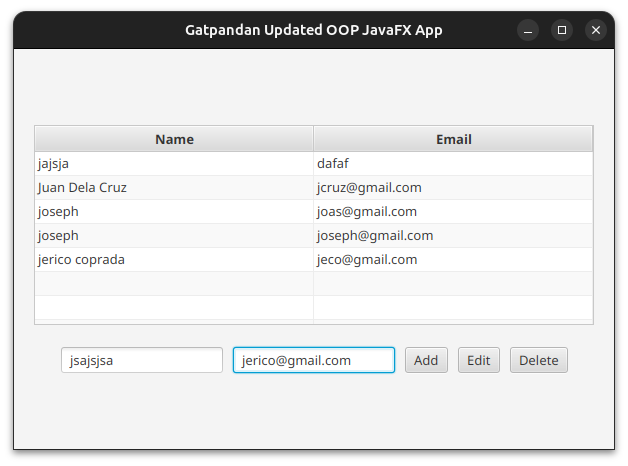
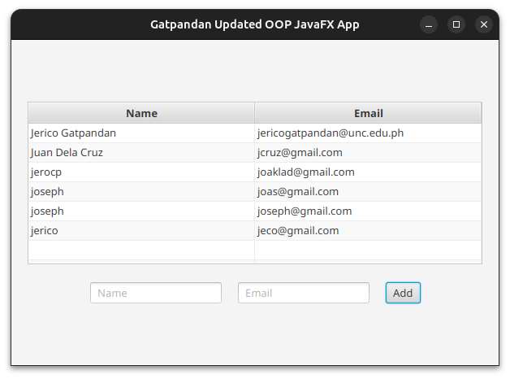
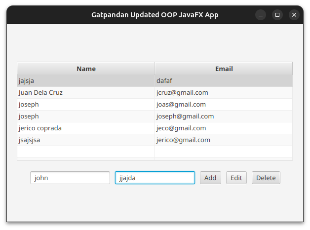
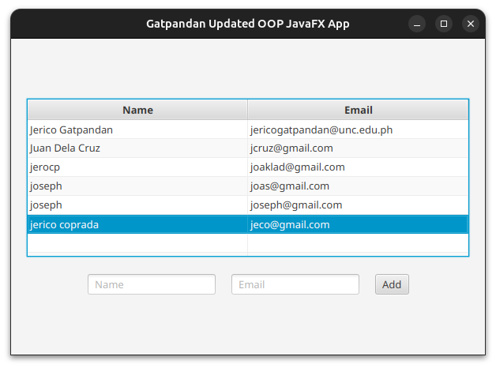
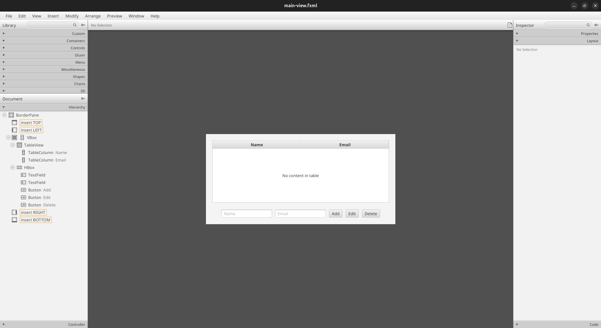
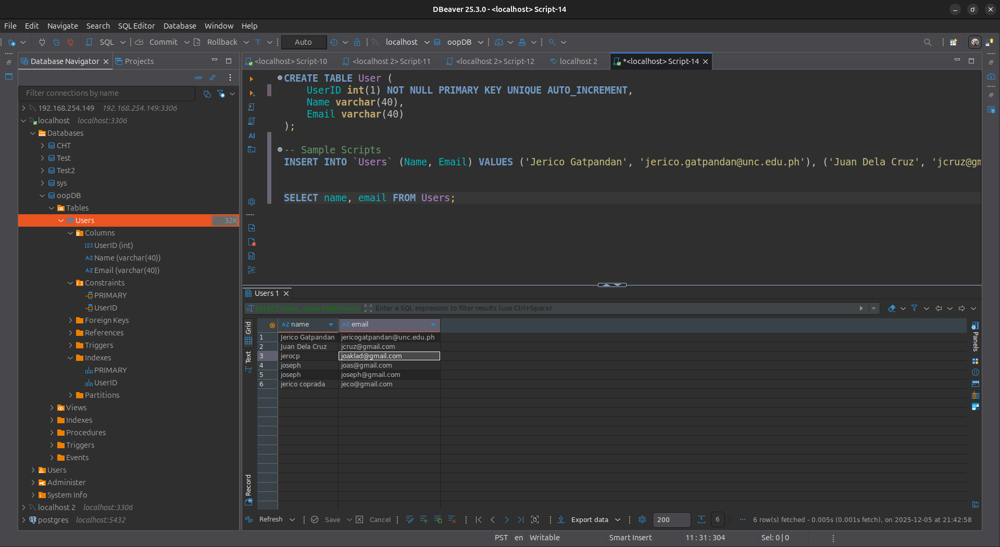

# OOP – Updated JavaFX Application

## Project Structure (Overview)

- `src/main/java/com/example/oop_updated_javafx/Launcher.java` – Launcher class for running the JavaFX app.
- `src/main/java/com/example/oop_updated_javafx/MainApplication.java` – Main JavaFX `Application` class.
- `src/main/java/com/example/oop_updated_javafx/MainController.java` – Controller for the main view.
- `src/main/java/com/example/oop_updated_javafx/model/User.java` – User model.
- `src/main/java/com/example/oop_updated_javafx/model/DatabaseConnection.java` – Handles DB connectivity.
- `src/main/resources/com/example/oop_updated_javafx/main-view.fxml` – FXML layout for the main UI.

## Screenshots

### Before and After

| Before                                                    | After                                                          |
|-----------------------------------------------------------|----------------------------------------------------------------|
|  |  |
|  |  |

### Scene Builder View

### DBMS View

## Submission Details

**Submitted To**  
Sir Danny Boy Casimero  
Faculty – School of Computer and Information Sciences

**Submitted By**  
Jerico C. Gatpandan  
BS Computer Science – 2nd Year  
University of Nueva Caceres
